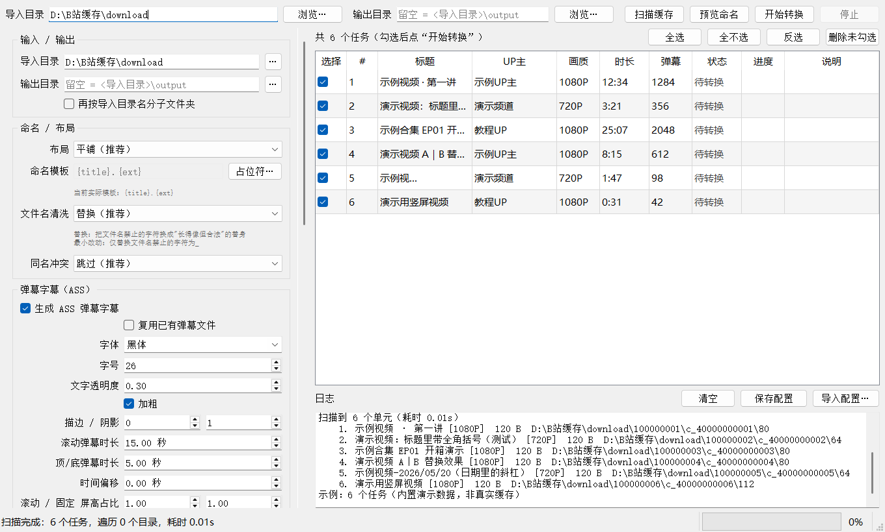

# B站缓存转换器


把 B 站客户端的离线缓存（`video.m4s` + `audio.m4s`）无损合并成可以直接播放 / 入库的
`mp4`，并可选生成 ASS 弹幕、hash 文件、封面、刮削文件。提供图形界面与命令行两种用法。

[](LICENSE)




---

## 目录

- [功能特性](#功能特性)
- [下载即用（免安装）](#下载即用免安装)
- [环境要求](#环境要求)
- [使用教程 · 图形界面](#使用教程--图形界面)
- [使用教程 · 命令行](#使用教程--命令行)
- [命名模板占位符](#命名模板占位符)
- [输出产物](#输出产物)
- [设计取舍与实现要点](#设计取舍与实现要点)
- [项目结构](#项目结构)
- [测试](#测试)
- [打包成独立 exe](#打包成独立-exe)
- [常见问题](#常见问题)
- [开源协议](#开源协议)


## 功能特性

- **无损合并**：`ffmpeg -c copy` 直接 stream copy，不解码不转码，画质零损失。
  也可切换 MP4Box。
- **图形界面**：PyQt5 主窗口，选项面板 + 任务列表 + 实时进度 + 日志面板。
- **5 种输出布局**：平铺 / 按标题建文件夹 / 按 UP 建文件夹 / 按合集建文件夹 / 自定义模板。
- **弹幕字幕**：完整实现 ASS 弹幕算法（滚动 / 顶部 / 底部 / 纯字幕、轨道碰撞、密度控制），
  字体、字号、透明度、时长、屏占比、画布分辨率全部可调；本地缺 `danmaku.xml` 时可联网抓取。
- **Hash 文件**：`md5(视频字节 ‖ 音频字节)`，逐字节稳定，可用于跨缓存版本去重。
- **附属文件**：mp4 元数据（title / artist / album）、封面导出、封面嵌入、`.nfo` 刮削文件、
  `danmaku.xml` 副本，每项独立开关。
- **只读源文件**：全程不删除、不改名、不移动缓存目录里的任何文件（中间产物写系统临时目录）。

---

## 下载即用（免安装）

不想装 Python？直接去 [Releases](../../releases) 页面下载最新的
`Bili_download_converter_v0.1.0_win64.zip`，解压后双击 `Bili_download_converter.exe` 即可。

压缩包里已经有图标、README 和许可证，**只需要再准备一个 `ffmpeg.exe`**（见下一节）。
把它放进系统 PATH，或者在界面左侧「合并引擎」里直接填 `ffmpeg.exe` 的绝对路径。

> 首次运行时 Windows Defender 可能提示"未知发布者"——这是未签名 exe 的正常提示，
> 点「更多信息 → 仍要运行」即可。介意的话可以按[打包成独立 exe](#打包成独立-exe)自己编译。

---

## 环境要求

| 依赖 | 说明 |
|---|---|
| Python | 3.10+（开发环境为 3.14） |
| ffmpeg | **必需**，需在 PATH 中或手动指定路径 |
| MP4Box | 可选，填了才用 |
| PyQt5 | 仅 GUI 需要，`pip install PyQt5` |

从源码运行：

```bat
git clone https://github.com/hehe1885/Bili_download_converter.git
cd Bili_download_converter
pip install -r requirements.txt
```

**ffmpeg 怎么装？** 到 [ffmpeg.org](https://ffmpeg.org/download.html) 或
[gyan.dev](https://www.gyan.dev/ffmpeg/builds/) 下载 Windows 版，解压后把
`bin` 目录加进 PATH；或者干脆只记住 `ffmpeg.exe` 的完整路径，填进软件的设置里。
装好后用 `python cli.py --check` 自检，能打印出 `[OK] 可用: ffmpeg=...` 就说明就位了。

---

## 使用教程 · 图形界面

### 1. 启动

```bat
python main.py
```

（下载的 exe 版本直接双击 `Bili_download_converter.exe`。）

### 2. 找到 B 站缓存目录

B 站客户端缓存目录结构大致长这样：

```
download/                                  ← 「导入目录」选这一层
├─ 116278203322248/                        ← avid，每个视频一个
│  └─ c_40090993383/                       ← cid
│     ├─ entry.json                        ← 元数据（标题、UP 主、画质…）
│     ├─ danmaku.xml                       ← 弹幕（可能没有）
│     ├─ cover.jpg                         ← 封面（可能没有）
│     └─ 80/                               ← 画质目录 64 / 80 / 112
│        ├─ video.m4s                      ← 视频轨
│        └─ audio.m4s                      ← 音频轨
└─ 116472248604685/
   └─ ...
```

缓存目录的默认位置（各客户端层级略有差别，**认准里面是一堆数字命名的 `avid` 目录的那一层**）：

| 平台 | 路径 |
| --- | --- |
| 安卓手机 | `我的手机/Android/data/tv.danmaku.bili/download` |
| Windows | `C:\Users\<你的用户名>\AppData\Roaming\BilibiliDownload\cache\data` |
| macOS | `/Users/<你的用户名>/Library/Application Support/Bilibili/com.bilibili.downloads/web_cache/data` |
| iOS | 通过 B 站 App 的「我的下载」栏目查看 |

上面路径里的「你的用户名」就是当前登录系统的账户名。`AppData` 是隐藏文件夹，需要在资源管理器的
「查看 → 显示 → 隐藏的项目」里打开才看得到。不同版本的客户端路径可能略有差别，
**也可以直接在 B 站客户端设置里看它当前用的下载位置。**

**注意：要选到含 `avid` 数字目录的那一层**（安卓端这一层就叫 `download`），不要直接选
`video.m4s` 所在的目录——程序会自动往下遍历，把所有画质都扫出来。

### 3. 扫描

点顶部 **扫描缓存**。任务列表会列出每一个可转换单元，并显示
标题 / UP 主 / 画质 / 时长 / 弹幕条数 / 状态。

- 没缓存完（`entry.json` 里状态不是 completed）的会被标成「已跳过」
- 只保留最高画质的一份，同一视频的多个画质不会重复出现在列表里
- 想先看看**文件名会长什么样**，点 **预览命名**，会列出每个任务的最终输出路径

### 4. 勾选任务

每行最左边有勾选框，也可以点 **全选** / **全不选** / **反选**。
不想要的先取消勾选，再点 **删除未勾选** 从列表里清掉。

### 5. 按需调整左侧选项

默认值就是推荐值，**第一次用可以完全不动**。想改的话：

| 分组 | 关键选项 |
|---|---|
| 输入 / 输出 | 输出目录留空 = `<导入目录>\output` |
| 命名 / 布局 | 平铺（`output\视频名.mp4`）／按标题建文件夹／按 UP 建文件夹／按合集建文件夹／自定义模板 |
| 文件名清洗 | **替换**（禁止字符换成"长得像"的替身）／**最小改动**（全换成 `_`） |
| 弹幕字幕（ASS） | 总开关、字体、字号、透明度、滚动/固定弹幕时长、画布分辨率 |
| 附属文件 | mp4 元数据、封面导出、封面嵌入、`.nfo` 刮削、弹幕 XML 副本 |
| Hash 文件 | 生成并用于去重／仅去重不生成／完全关闭 |
| 行为 | 跳过未缓存完、跳过已转换、同名冲突处理、并发数、完成后打开输出目录 |
| 合并引擎 | 自动／只用 ffmpeg／只用 MP4Box |

选项会在**退出时自动保存**到 `%APPDATA%\Bili_download_converter\config.json`，
下次启动自动载入。也可以手动 **保存配置** / **导入配置**。

### 6. 开始转换

点 **开始转换**。进度条与状态列实时刷新，右下角日志面板会打印每一步的命令与结果。
中途想停就点 **停止**——已经完成的文件不会被回滚，未完成的会留下 `FAILED` 记录在日志里。

转换完成后，如果勾了「完成后自动打开输出目录」，资源管理器会自动弹出来。

> **源文件始终是只读的。** 本程序不删除、不改名、不移动缓存目录里的任何文件。
> 中间产物写在系统临时目录，转换结束就清理掉。

---

## 使用教程 · 命令行

GUI 与 CLI 共用同一套引擎，不方便开窗口时可直接用命令行。

```bat
rem 自检：ffmpeg / MP4Box 探测结果
python cli.py --check

rem 只看会扫出什么，不真的转换
python cli.py -i "C:\Users\你\Desktop\download" --list

rem 平铺输出，生成弹幕字幕 + hash + nfo
python cli.py -i "C:\Users\你\Desktop\download" --layout flat

rem 指定输出目录、并发 4、不写 hash、不生成字幕
python cli.py -i "<缓存目录>" -o "D:\videos" --layout title_dir -j 4 --assoff --no-hash

rem 先看命名结果再决定（会列出每个任务的最终输出路径）
python cli.py -i "<缓存目录>" --preview

rem 对比两种文件名清洗规则的效果
python cli.py -i "<缓存目录>" --name-filter safe --preview   rem 替换：/ → ／、【补档】原样、空格原样
python cli.py -i "<缓存目录>" --name-filter keep --preview   rem 最小改动：/ → _、【补档】原样

rem 强制走命令行（main.py 默认开 GUI）
python main.py --cli -i "<缓存目录>" --list
```

常用参数：

| 参数 | 说明 |
|---|---|
| `-i/--input/--cachepath` | 导入目录（必填） |
| `-o/--output` | 输出目录，留空 = `<导入目录>\output` |
| `--layout` | `flat` / `title_dir` / `up_dir` / `original` / `template` |
| `--template` | 自定义模板，仅 `--layout template` 时生效 |
| `--name-filter` | `safe`（替换，默认）/ `keep`（最小改动） |
| `--conflict` | `skip` / `overwrite` / `rename` / `ask` |
| `--assoff` | 不生成 ASS 字幕 |
| `--font` `--font-size` `--alpha` | 字幕字体 / 字号 / 透明度 |
| `--canvas` | `auto`（跟随视频，推荐）或 `1920x1080` 等 |
| `--hash-mode` | `write` / `dedup_only` / `off` |
| `--no-nfo` `--no-cover` `--no-metadata` `--no-danmaku-xml` | 关闭对应附属产物 |
| `-j/--workers` | 并发任务数 |
| `--engine` | `auto` / `ffmpeg` / `mp4box` |
| `--dry-run` `--list` `--preview` `--check` | 预览与自检，不写文件 |
| `--save-config` `--config` | 保存 / 指定配置文件 |
| `--limit N` | 只处理前 N 个（调试用） |

完整列表：`python cli.py -h`

---

## 命名模板占位符

`--layout template` 或 GUI 的「自定义模板」可用：

| 占位符 | 含义 | 占位符 | 含义 |
|---|---|---|---|
| `{title}` | 视频标题 | `{qid}` | 画质代码 64/80/112 |
| `{part}` | 分 P 名 | `{quality}` | 画质描述 1080P |
| `{up}` | UP 主 | `{date}` `{time}` | 转换日期 / 时间 |
| `{group}` | 合集 / 分组名 | `{index}` | 任务序号，可写 `{index:03d}` |
| `{series}` | 番剧 / 系列名 | `{danmaku}` | 弹幕条数 |
| `{avid}` `{bvid}` `{cid}` | 稿件标识 | `{w}` `{h}` `{duration}` | 宽 / 高 / 秒数 |
| `{original}` | 缓存目录名 | `{ext}` | 扩展名 |

用 `/` 可以建子目录，例如 `{up}/{title}.{ext}`。

---

## 输出产物

每个视频最多生成 6 个文件，全部以 mp4 主名为前缀，便于平铺布局下不互相覆盖：

```
output\
  示例视频第一讲.mp4            ← 合并后的视频
  示例视频第一讲.ass            ← 弹幕字幕
  示例视频第一讲.hash           ← md5(视频‖音频)，32 位小写 hex
  示例视频第一讲.nfo            ← Emby / Jellyfin / Kodi 刮削
  示例视频第一讲.danmaku.xml    ← 原始弹幕 XML 副本
  示例视频第一讲-poster.jpg     ← 封面
```

---

## 设计取舍与实现要点

以下是有意为之的实现选择与理由：

1. **画布分辨率**：默认跟随视频真实分辨率，而不是固定 `1920x1080`
   （竖屏视频 1080x1920 套 1920x1080 画布会把弹幕拉伸变形）。可用 `--canvas 1920x1080` 指定固定画布。
2. **中间产物位置**：`-video.mp4` / `-audio.mp3` 等中间产物写到系统临时目录
   并在结束后清理，**绝不碰缓存目录里的源文件**。
3. **`up` 兜底**：取不到 `uname` 时回退 `owner_name`。
4. **mp4 元数据**：写入
   `title=视频标题 / artist=UP主 / album=合集`，更适合媒体库识别。
5. **附属产物**：生成 `.nfo` 刮削文件（Emby / Jellyfin / Kodi 刮削用）。
6. **产物校验**：同一样本计算出的 `.hash` 均为 `6cff56db41ffad45576c73e42c4900a8`，
   ASS 头部逐字符稳定。
7. **文件名替换**：只碰 Windows 禁止的 9 个半角字符 `< > : " / \ | ? *`，把它们换成
   **长得像但合法**的替身，其余（含空格、`（）`、`【】`、中文标点）一律原样保留；
   先 strip 首尾空格再替换，避免留下首尾下划线。

两种清洗规则都只碰 Windows 禁止的 `< > : " / \ | ? *`，区别只有**换成什么**：

| 原字符 | 替换（默认） | 最小改动 |
|---|---|---|
| `<` `>` | `《` `》` 中文书名号 | `_` |
| `"` | `'` 单引号 | `_` |
| `:` | `：` 全角 | `_` |
| `?` | `？` 全角 | `_` |
| `/` | `／` 全角 | `_` |
| `\` | `＼` 全角 | `_` |
| `\|` | `｜` 全角 | `_` |
| `*` | `＊` 全角 | `_` |
| `（）` `【】` 空格 中文标点 | 原样保留 | 原样保留 |
| 控制字符 | 删除 | 删除 |
| 结尾的点和空格 | 去掉 | 去掉 |
| `CON`/`NUL`/`COM1` 等 22 个保留名 | 前面加 `_` | 前面加 `_` |

例：`示例视频-2026/05/20 <上>`

```
替换       示例视频-2026／05／20 《上》.mp4
最小改动   示例视频-2026_05_20 _上_.mp4
```

---

## 项目结构

```
Bili_download_converter/
├─ main.py                  入口：默认启动 GUI，--cli 走命令行
├─ cli.py                   命令行界面（全部选项）
├─ gui/
│  ├─ main_window.py        主窗口
│  ├─ options_panel.py      选项面板（Options ←→ 控件 双向映射）
│  └─ worker.py             QThread：扫描线程 / 转换线程
├─ m4sconverter/
│  ├─ models.py             数据类与枚举
│  ├─ scanner.py            扫描缓存、配对 m4s
│  ├─ metadata.py           entry.json / .playurl 等多源元数据归一化
│  ├─ naming.py             布局与模板渲染
│  ├─ converter.py          10 步转换流水线（核心）
│  ├─ mux.py                ffmpeg / MP4Box 命令构建与引擎探测
│  ├─ hashfile.py           md5 计算与去重
│  ├─ nfo.py                .nfo 生成
│  ├─ config.py             JSON 配置持久化
│  ├─ utils.py              改名规则、路径安全、子进程调用
│  └─ danmaku/
│     ├─ ass_writer.py      ASS 生成（算法自行实现，输出格式稳定）
│     ├─ xml_parser.py      弹幕 XML 流式解析
│     └─ fetcher.py         缺失弹幕联网下载
├─ tests/
│  ├─ smoke_test.py         离线冒烟测试（改名 / 路径安全 / ASS / hash）
│  ├─ gui_smoke_test.py     GUI 冒烟测试（--real 可跑真实转换）
│  └─ make_screenshot.py    生成界面预览图 docs/gui.png
├─ docs/
│  └─ gui.png               界面预览图
├─ assets/
│  ├─ icon.ico              程序图标（PyInstaller --icon / 窗口图标）
│  └─ icon.png              图标 PNG 版（README 用）
├─ build.bat                PyInstaller 打包脚本（纯 ASCII）
├─ LICENSE                  MIT 许可证
├─ config.example.json      配置模板
└─ requirements.txt
```

---

## 测试

```bat
python tests/smoke_test.py                      rem 离线：改名规则、路径安全、ASS、hash
python tests/gui_smoke_test.py                  rem GUI 构建与选项往返（offscreen）
python tests/gui_smoke_test.py --real           rem 真实扫描 + 转换一个视频
```

---

## 打包成独立 exe

```bat
build.bat                     rem 目录版（启动快，推荐）
build.bat onefile             rem 单文件 exe（便于分发）
build.bat onedir D:\out       rem 自定义输出目录
```

脚本会自动安装 PyQt5 / PyInstaller，编译自检后用 PyInstaller 打一次 windowed 包
（不含控制台黑框），并套上 `assets/icon.ico` 作为程序图标。

产物默认写到**桌面**上的 `Bili_download_converter_v0.1.0\`，刻意放在项目外面，
避免把构建垃圾塞进仓库。目录版的 exe 在 `Bili_download_converter\Bili_download_converter.exe`。

> 打包脚本刻意写成**纯 ASCII**：`cmd.exe` 按系统 ANSI 代码页（中文 Windows 是 GBK）
> 解析 `.bat`，脚本里出现 UTF-8 中文会被解析成乱码命令。改脚本时请保持 ASCII。

产物仍然需要外部的 `ffmpeg.exe`：要么放进 PATH，要么在界面的「合并引擎」里指定路径。

---

## 开源协议

本项目采用 **MIT License** 发布，全文见 [LICENSE](LICENSE)。

```
Copyright (c) 2026 hehe1885
```

简单说：可以自由使用、修改、分发、商用，只需保留版权声明与许可证文本；作者不承担担保责任。

### 第三方依赖

| 组件 | 协议 | 是否随本项目分发 |
|---|---|---|
| [ffmpeg](https://ffmpeg.org/) | LGPL / GPL（取决于编译选项） | ❌ 需用户自行安装 |
| [PyQt5](https://riverbankcomputing.com/software/pyqt/) | GPL v3 / 商业双许可 | 打包进 exe 时随附 |
| Qt 运行时 | LGPL v3 | 同上 |
| Python 标准库 | PSF License | 同上 |

> 说明：**本仓库自身的代码是 MIT**；但打包成 exe 时会把 PyQt5（GPL v3）一并分发，
> 因此发布出去的分发物整体需要满足 GPL v3 的要求——本仓库已公开全部源码，这一点是满足的。
> 如果你想把本项目的代码用进自己的**闭源**软件，请把 GUI 换成
> [PySide6](https://doc.qt.io/qtforpython/)（LGPL），或购买 PyQt 商业授权。

### 免责声明

本工具只对**用户本机已有的缓存文件**做格式转换，不提供下载、破解，也不绕过任何平台限制。
请遵守 B 站用户协议，转换所得文件仅供个人离线观看，请勿再分发。

---

## 常见问题

**扫描不到任务？**
导入目录要选到**包含 avid 子目录的那一层**（例如 `download`），不是直接选 `video.m4s` 所在目录。

**提示找不到引擎？**
`python cli.py --check` 会打印探测结果。装好 ffmpeg 后确保 `ffmpeg.exe` 在 PATH 里，
或在界面里直接指定绝对路径。

**为什么音频源叫 `.mp3` 但内容是 AAC？**
B 站缓存的文件名有误导性，`.m4s` 里装的是 fMP4。本版用 ffmpeg 按容器原样搬运，
不依赖扩展名，所以不会出问题。

**转换过的视频会不会重复转？**
默认开启：先比 `.hash`，再比体积（容差 1MB），命中就跳过。可在选项里关掉。

**下载的 exe 加 `--cli` 怎么不输出东西？**
发布版是按 **windowed** 模式打包的（不弹控制台黑框），因此 exe 没有 stdout 可以打印。
需要用命令行就从源码跑 `python cli.py ...`；想自己编译一个带控制台的版本，
把 `build.bat` 里的 `--windowed` 去掉再打包即可。

**exe 报"缺少 VCRUNTIME140.dll"之类的错误？**
装一下 [Microsoft Visual C++ 可再发行组件](https://aka.ms/vs/17/release/vc_redist.x64.exe)。
Windows 10/11 通常已经自带。

**杀毒软件报毒？**
PyInstaller 打的包偶尔会被误报（尤其是单文件版）。介意的话按上面的步骤自己编译；
目录版比单文件版更少触发误报。
